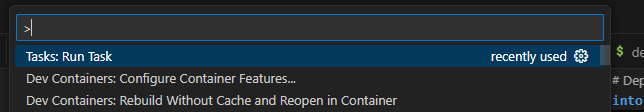
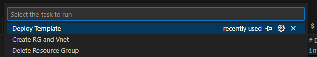

# Starter Azure RedHat OpenShift for IL5
Infrastructure-as-Code template for Deploying Azure RedHat OpenShift in an IL5 environment.  The goal being to provide a starter template for getting an environment created and providing all the baseline controls.  

# Deploy directy from this readme

You can deploy this template directly to Azure Government by clicking the button below:

[](https://portal.azure.us/#create/Microsoft.Template/uri/https%3A%2F%2Fraw.githubusercontent.com%2Fmack-bytes-government%2Fstarter-aro-il5%2Frefs%2Fheads%2Fkm%2Fmain%2Fmain.bicep)

# Installing Azure CLI

To manage your Azure resources, you need to install the Azure CLI. Follow the instructions below to download and install it on your system.

## Windows

1. Download the Azure CLI installer from the following link: [Azure CLI Installer](https://aka.ms/installazurecliwindows).
2. Run the installer and follow the on-screen instructions.

## macOS

1. Open your terminal.
2. Run the following command to install Azure CLI using Homebrew:
    ```bash
    brew update && brew install azure-cli
    ```

## Linux

1. Open your terminal.
2. Run the following commands to install Azure CLI using the package manager for your distribution:

    **Debian/Ubuntu:**
    ```bash
    curl -sL https://aka.ms/InstallAzureCLIDeb | sudo bash
    ```

    **RHEL/CentOS:**
    ```bash
    sudo rpm --import https://packages.microsoft.com/keys/microsoft.asc
    sudo sh -c 'echo -e "[azure-cli]
    name=Azure CLI
    baseurl=https://packages.microsoft.com/yumrepos/azure-cli
    enabled=1
    gpgcheck=1
    gpgkey=https://packages.microsoft.com/keys/microsoft.asc" > /etc/yum.repos.d/azure-cli.repo'
    sudo yum install azure-cli
    ```

    **Fedora:**
    ```bash
    sudo rpm --import https://packages.microsoft.com/keys/microsoft.asc
    sudo dnf install -y https://packages.microsoft.com/yumrepos/azure-cli/azure-cli-2.0.81-1.el7.x86_64.rpm
    ```

    **openSUSE:**
    ```bash
    sudo rpm --import https://packages.microsoft.com/keys/microsoft.asc
    sudo zypper addrepo --name 'Azure CLI' --check https://packages.microsoft.com/yumrepos/azure-cli azure-cli
    sudo zypper install --from azure-cli -y azure-cli
    ```

After installation, you can verify the installation by running:

```bash
az --version
```

# Logging into Azure

The following steps will make it possible to deploy with a brand new network:
For deploying to Azure Government run the following:

```bash
az cloud set --name AzureUSGovernment
```

The following is the command to login.  

```bash
az login
```

# Pre-requisites

The following are pre-reqs for using this repo.

## Creating Environment JSON:

For this implementation, you need to create an environment json, there is a sample in the repo under the '''./envs/sample.json'''.

You can create a new file using the following command:

```
ENV_FILE_NAME="" # Name of the file
cp ./envs/sample.json "./envs/$ENV_FILE_NAME"
```

You will then need to populate the following parameters:

## Setting Configuration Parameters:

Below is an example configuration that you can use to populate your environment JSON file:

```json
{
    "networkResourceGroupName": "starter-aro-il5",
    "vnetName": "starter-aro-il5-vnet",
    "location": "usgovvirginia",
    "subnetName": "default",
    "projectPrefix": "aro1",
    "envPrefix": "dev",
    "defaultTagName": "Environment",
    "defaultTagValue": "dev",
    "servicePrincipalClientId": "",
    "servicePrincipalClientSecret": "",
    "subscriptionId":"",
    "deployJumpBox": false,
    "jumpboxUsername": "",
    "jumpboxPassword": ""
}
```

The values are:
**resourceGroupName:** The resource group to deploy to.
**vnetName:** The name of the virtual network to connect to.  
**location:** The region to deploy to.
**subnetName:** The name of the default subnet to make sure that the newly created vnet has.  *Only required if you are creating a new virtual network as a starting point.*
**projectPrefix:** A prefix to denote as part of the naming convention. 
**envPrefix:** A prefix identifying the environment being deployed.  
**defaultTagName:** A default tag to put on the environment. 
**defaultTagValue:** The value of the tag to be applied to all resources on the environment. 
**servicePrincipalClientId:** The Client ID of the Service Principal required for ARO.
**servicePrincipalClientSecret:** The Client Secret of the Service Principal required for ARO.  
**subscriptionId:** The subscription id being deployed to.
**deployJumpBox:** True / False for deploying a jumpbox with bastion.
**jumpboxUsername:** The username for accessing the jumpbox.  
**jumpboxPassword:** The password for accessing the jumpbox.  

Make sure to replace the `servicePrincipalClientId` and `servicePrincipalClientSecret` with the values from your created service principal.

## Creating Service Principal:

For this template, you will need to provide a service principal.

You can generate it with the following command:

```bash
# The name of the resource group
SP_NAME=""

az ad sp create-for-rbac --name "sp-$SP_NAME-${RANDOM}" > app-service-principal.json
SP_CLIENT_ID=$(jq -r '.appId' app-service-principal.json)
SP_CLIENT_SECRET=$(jq -r '.password' app-service-principal.json)
SP_OBJECT_ID=$(az ad sp show --id $SP_CLIENT_ID | jq -r '.id')
```

**NOTE: The Service Principal will need "Network Contributor" role on the virtual network being leveraged.**

This can be assigned with the following:

```bash
SERVICE_PRINCIPAL_CLIENT_ID="" # The client id
VNET_RESOURCE_ID="" # The resource id of the virtual network.
az role assignment create --assignee $SERVICE_PRINCIPAL_CLIENT_ID --role "Network Contributor" --scope $VNET_RESOURCE_ID
```

## Update Reference

To make all tasks point to your configuration, you can update the ENV_FILE found [here](./scripts/common.sh).

# Network Considerations:

The following are key network considerations for deploying Azure RedHat OpenShift.  

1. You must have a big enough cidr block.  ARO requires that the pod cidr supports a /18.  
1. Granting "Network Contributor" rights to your virtual network for the "Azure RedHat OpenShift Resource Provider", more can be found [here](https://learn.microsoft.com/en-us/answers/questions/1687840/whats-the-purpose-and-role-of-azure-red-hat-opensh).

# Deploy this template

For this, we have 3 options for deploying this template:

1. Deploy directly from this readme.
1. Deploy using vscode tasks
1. Deploy manually

**NOTE: This deployment can take around 60 minutes to deploy into your environment.**

## Deploy directy from this readme

You can deploy this template directly to Azure Government by clicking the button below:

[](https://portal.azure.us/#create/Microsoft.Template/uri/https%3A%2F%2Fraw.githubusercontent.com%2Fmack-bytes-government%2Fstarter-aro-il5%2Frefs%2Fheads%2Fkm%2Fmain%2Fmain.bicep)

## Deploy using vscode tasks

For this project, we have implemented vscode tasks for common operations to make it easier to use.  These include the following:

- **Az Login:** Performs an azure cli login.  
- **Delete Resource Group:** Will leverage Azure CLI to delete the resource group that is being used to deploy this template.  
- **Create RG and Vnet:** Will leverage Azure CLI to create a resource group and landing vnet for this solution.  
- **Deploy Template:** Will leverage Azure CLI to deploy the bicep template. 

To run this tasks, you can click "F1" or "Ctrl+Shift+P" or go to "Terminal" => "Run Task".

The following menu will appear:



And then select your task:



## Deploy template manually

You can leverage the following to deploy this template to your environment:

**NOTE: This requires the an existing virtual network to deploy.  To Create one, use the following:**

```bash
bash ./scripts/create-rg-vnet.sh
```

**NOTE: You will need to give your service principal and the "Azure Open Shift RP" service principal "Network Contributor" rights.**

```bash
bash ./scripts/deploy-template.sh
```

# Delete Infrastructure

If you need to clean up the infrastructure, you can do so by running the following:

```bash
bash ./scripts/delete-rg.sh
```